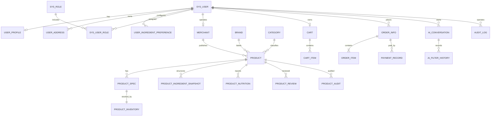

# 核心 ER 图

```mermaid
erDiagram
    SYS_USER ||--o| USER_PROFILE : has
    SYS_USER ||--o{ USER_ADDRESS : owns
    SYS_USER ||--o{ USER_INGREDIENT_PREFERENCE : configures
    SYS_USER ||--o{ SYS_USER_ROLE : assigned
    SYS_ROLE ||--o{ SYS_USER_ROLE : includes
    SYS_USER ||--o| MERCHANT : operates
    MERCHANT ||--o{ PRODUCT : publishes
    BRAND ||--o{ PRODUCT : labels
    CATEGORY ||--o{ PRODUCT : classifies
    PRODUCT ||--o{ PRODUCT_SPEC : has
    PRODUCT_SPEC ||--|| PRODUCT_INVENTORY : stocked_by
    PRODUCT ||--o{ PRODUCT_INGREDIENT_SNAPSHOT : structures
    PRODUCT ||--o{ PRODUCT_NUTRITION : reports
    SYS_USER ||--o| CART : owns
    CART ||--o{ CART_ITEM : contains
    SYS_USER ||--o{ ORDER_INFO : places
    ORDER_INFO ||--|{ ORDER_ITEM : contains
    ORDER_INFO ||--o{ PAYMENT_RECORD : paid_by
    PRODUCT ||--o{ PRODUCT_REVIEW : reviewed
    PRODUCT ||--o{ PRODUCT_AUDIT : audited
    SYS_USER ||--o{ AI_CONVERSATION : starts
    AI_CONVERSATION ||--o{ AI_FILTER_HISTORY : records
    SYS_USER ||--o{ AUDIT_LOG : operates
```

独立的 [er-diagram.mmd](./er-diagram.mmd) 包含权限、图片、价格、收藏、浏览历史和工作流等更完整关系。图中订单项连接商品仅用于追溯；商品名称、规格、价格和图片均在订单项中保存快照。
